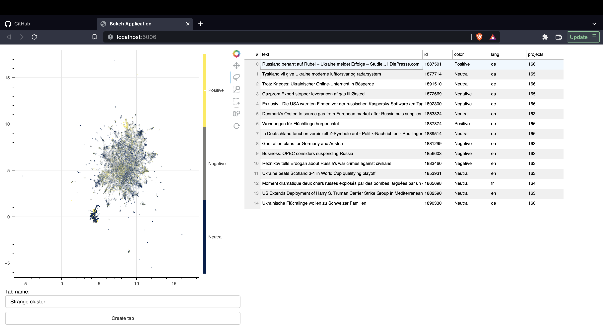

# bundler

Bundler is a tool to help you gain insights from your dataset. Given 2D embeddings you can use the UI to either spot
wrong annotations or simply label samples per batch.



# Install

```
git clone https://github.com/JulesBelveze/bundler.git
```

## Disclaimer

The original tool from [koaning](https://github.com/koaning) can be found [here](https://github.com/koaning/bulk), but I
forked the project and kept working on a duplicate as our use cases were different.

## Usage

To use `bundler`, you first need to prepare your dataset to be mapped into a 2D embedding space.
You can find a couple of scripts under the `scripts/` folder on how to retrieve such coordinates.

Once your dataset is ready you can now open the UI and start exploring your data by running:

```
python3 -m bundler text [MY_FILE]
```

## Usecase

The interface may help you label very quickly. It enables you to directly create tabs
on [Label Studio](https://labelstud.io/) to either correct or create labels.

As you might have noticed the tool was developed to handle textual data. However, it should be easily extendable to any
other data type.
